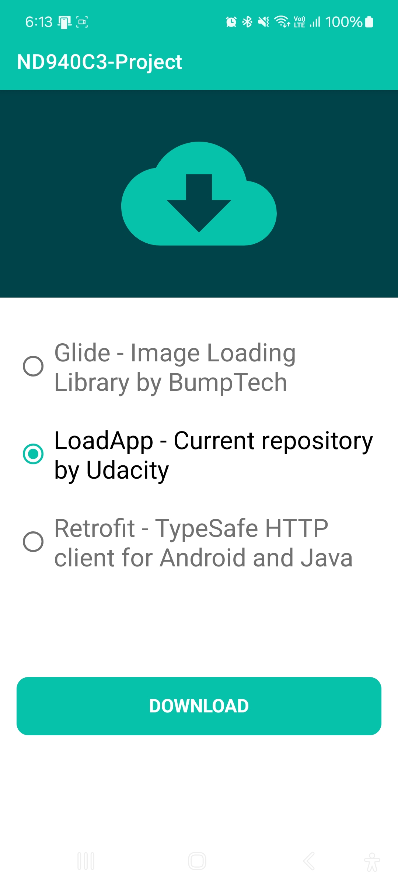

# AnimatedProgressButton

**"A Custom Animated Progress Button app that animates three statuses of the Button: Idle, Loading, and Completed, with a sleek design, also showcasing clean architecture."**

AnimatedProgressButton is an app designed to help developers craft an animated button for download buttons, featuring a custom design and animation. It allows you to control the button's three statuses: Idle, Progress, and Completed, using XML. The project also uses MotionScene to animate views after opening a fragment. This project is part of the **Udacity Android Kotlin Developer Nanodegree Program**.

## Main Features of the Project

- **MVVM Architecture**: Implements an MVVM pattern for clean, maintainable architecture.
- **Custom View**: Creates a custom animated button that can change its attributes using XML.
- **MotionScene**: Implements MotionScene to animate views in the download detail fragment.
- **Orientation Support**: Adapts to portrait and landscape orientations without losing data.
- **Notification Handling**: Displays and handles notifications for all Android versions.
- **Modern UI**: Uses a single-activity architecture with multiple fragments.
- **Download Manager**: Uses a download manager to download from a URL.
- **Dependency Injection**: Koin (v4) used for better modularity and testability.

## Project Resources

- [Starter Project Code](https://github.com/udacity/nd940-c3-advanced-android-programming-project-starter): Get the starter code for the project.
- [Project Rubric](https://docs.google.com/document/d/1xmW1wM-Ch1pa3Ldoz5TBd-9qXCTSv9LfX2ZOECJrJjE/edit?usp=sharing): View the project rubric.
- [Android Kotlin Developer Nanodegree Program](https://www.udacity.com/course/android-kotlin-developer-nanodegree--nd940): Learn more about the full program and its related projects.

## Snapshots from the App

### Phone Screens (Portrait)  

<table style="width: 100%; table-layout: fixed;">
<tr>
 <td align="center" style="width: 50%;">
   
   
<strong>Select Download URL Screen</strong> Select a URL for downloading, using MVVM to save and update the status dynamically.

 </td>
 <td align="center" style="width: 50%;">
   
   
<strong>Project Showcase</strong> Button transitions between Idle, Loading, and Completed states, also MotionScene for Views.

 </td>
</tr>
</table>

### Phone Screens (Landscape)  

<strong>Landscape Mode</strong> Optimized for a seamless landscape viewing experience..

  

## Customization

### Some Attributes

| Option Name        | Format  | Description                                          |
| ------------------ | ------- | ---------------------------------------------------- |
| buttonIdleColor    | `color` | Sets the Idle color of the button                    |
| buttonLoadingColor | `color` | Sets the loading fill color of the button            |
| circleLoadingColor | `color` | Sets the color of the loading circle                 |
| textAllCaps        | `bool`  | Controls button text capitalization (default: false) |
| textStyling        | `enum`  | Choose between normal, bold, italic, bold_italic     |
| cornerSize         | `dimen` | Sets the corner radius of the button                 |
| textSize           | `dimen` | Sets the text size of the button                     |

  

## Installation Guide

This project doesn't require any previous setup. Follow these steps to run the app:

1. **Clone the Repository**: Clone the project repository using Git.
2. **Open in Android Studio**: Open the project in **Android Studio Ladybug (2024.2.1 Patch 2)** or later.
3. **Build the Project**: Use **Gradle Plugin v8.7.2** to build the project.

**Note:** Ensure you have the latest version of Android Studio and the Gradle build tool installed. Refer to the [official guide](https://developer.android.com/studio/install) if needed.

## Included External Libraries

- **[Koin (v4)](https://github.com/InsertKoinIO/koin)**: Dependency injection.
- **[Timber](https://github.com/JakeWharton/timber)**: Logging utility.

## Contributing

Contributions are welcome! Please open an issue or submit a pull request for improvements or bug fixes.

## Contact

If you have any questions or need support, please get in touch with me through the issues section or contribute directly to enhance the project.

## License

This project is open-source and licensed under the Apache 2.0 License. For more details, see the LICENSE file in this repository.
